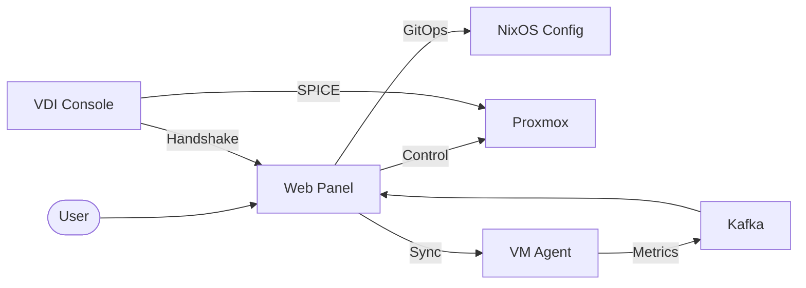

# VDI System Administration: Ephemeral Declarative Infrastructure

## Project Objective
The goal of this project is to provide a high-performance, ephemeral, and declaratively managed Virtual Desktop Infrastructure (VDI). It enables the rapid provisioning of NixOS-based workspaces that are "reset on reboot" using the Impermanence pattern, ensuring a clean and consistent state for every user session while maintaining critical system identity via persistent storage. The system bridges modern web orchestration (Next.js) with low-level system configuration (NixOS) and real-time telemetry (Kafka/InfluxDB).

## Project Structure & Sub-Projects

This monorepo contains several specialized modules that coordinate to provide the full VDI experience:

### 1. [web-panel/](./web-panel/) (The Orchestrator)
A Next.js control plane that serves as the "Brain" of the operation.
- **Function:** Manages VM lifecycles via Proxmox API, handles RBAC-based user authentication, orchestrates GitOps configuration changes, and aggregates real-time metrics via Kafka and WebSockets.

### 2. [nixos-config/](./nixos-config/) (The Desired State)
A declarative NixOS Flake configuration.
- **Function:** Defines the "Golden Template" for all VM instances. It implements the Impermanence logic (Root-on-RAM) and provides the base environment for user sessions.

### 3. [vm-agent/](./vm-agent/) (The Actuator)
A Go-based service running inside each NixOS VM.
- **Function:** Listens for sync requests from the Web Panel, pulls the latest GitOps configuration, and executes `nixos-rebuild` to bring the VM into its desired state.

### 4. [vdi-console/](./vdi-console/) (The Thin Client)
A specialized Go actuator for terminal hardware.
- **Function:** Performs a secure handshake with the Web Panel to acquire SPICE session tickets and launches `remote-viewer` for high-performance desktop access.

## High-Level Architecture

## Documentation Suite
For detailed technical information, refer to the [documentation/](./documentation/) directory:
- [Technical Architecture](./documentation/TECHNICAL_ARCHITECTURE.md)
- [API Specification](./documentation/API_SPECIFICATION.md)
- [Data Layers](./documentation/DATA_LAYERS.md)
