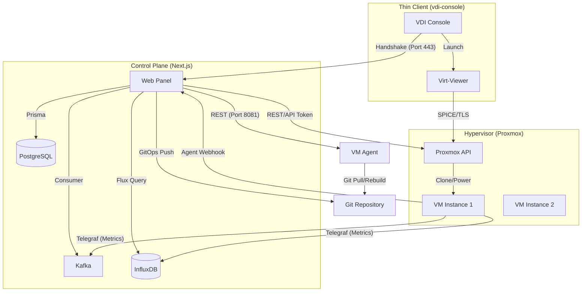

# Technical Architecture: VDI System Administration

## 1. General System Overview
The VDI System is a distributed, ephemeral Virtual Desktop Infrastructure platform designed for high-density, declarative workspace management. It leverages a three-tier architecture combining a hypervisor layer, a declarative guest operating system, and a centralized control plane.

### 1.1 Architectural Pillars
- **Hypervisor (Proxmox VE):** Serves as the compute substrate, providing API-driven lifecycle management for QEMU/KVM instances.
- **Declarative OS (NixOS):** Provides immutable, reproducible system configurations. VMs are "ephemeral by default," utilizing the **Impermanence** pattern to reset state on reboot while persisting critical identity data.
- **Control Plane (Next.js):** Orchestrates the ecosystem, managing user authentication, VM provisioning via GitOps, and real-time telemetry aggregation.

### 1.2 System Topology

---

## 2. Module Relations

### 2.1 Web-Panel (Orchestrator)
The Web-Panel acts as the Brain of the system.
- **Provisioning:** Clones VMs from a Golden Template (ID 100) using the Proxmox API.
- **Configuration Management:** Modifies Nix expressions (`packages.nix`) and pushes changes to a central Git repository.
- **Telemetry:** Consumes WebSocket streams for live metrics and queries InfluxDB for historical data.
- **Console Gateway:** Validates thin-client handshakes and generates SPICE `.vv` session descriptors.

### 2.2 VM-Agent (Actuator)
A Go-based service running within each NixOS instance.
- **Sync Trigger:** Listens for HTTP POST requests from the Web-Panel.
- **Reconciliation:** Executes `git pull` followed by `nixos-rebuild switch` to align the local state with the Git repository.
- **Feedback Loop:** Reports build status and execution logs back to the Web-Panel via authenticated webhooks.

### 2.3 VDI Console (Thin Client)
A specialized Go actuator for dedicated terminal hardware.
- **Handshake:** Authenticates with the Web-Panel using a Pre-Shared Key (PSK).
- **Session Orchestration:** Receives and parses SPICE connection parameters to launch `remote-viewer` (Virt-Viewer).

### 2.4 NixOS-Config (Desired State)
The source of truth for the entire infrastructure.
- **Flake-based:** Ensures version-locked dependencies.
- **Persistence:** Defines paths in `/persist` to retain machine identity (SSH keys, `machine-id`) while discarding user-session entropy.

---

## 3. Communication Protocols

| Interface | Protocol | Purpose |
| :--- | :--- | :--- |
| **Control Path** | REST (JSON) | Web-Panel -> Proxmox & Web-Panel -> VM-Agent |
| **Messaging** | Apache Kafka | VM Telemetry (Telegraf) -> Web-Panel |
| **Data Stream** | WebSockets | Real-time UI updates (Notifications/Metrics) |
| **Telemetry** | InfluxDB (Flux) | Historical resource utilization tracking |
| **State Sync** | Git (SSH/HTTPS) | Configuration distribution via GitOps |

---

## 4. Authentication & Authorization

### 4.1 NextAuth JWT Strategy
The Control Plane uses NextAuth with a JWT strategy for session management. Tokens are signed and stored in HTTP-only cookies, ensuring protection against XSS.

### 4.2 Custom RBAC (Guard Names)
Access control is implemented via a granular Permission-Role model:
- **Users** are assigned **Roles**.
- **Roles** map to multiple **Permissions** identified by `guardName` (e.g., `vm.create`, `faculty.vm.control`).
- Middleware and Server Actions validate these guards before execution.

### 4.3 Proxmox API Tokens
Communication with Proxmox utilizes API Tokens (`PVEAPIToken`) with specific privileges, avoiding the use of root credentials.

---

## 5. Infrastructure Identity: Impermanence Logic

The system implements a "Root on RAM" or "Erase Your Darlings" approach.
- **Root Partition (`/`):** Ephemeral (reset on reboot).
- **Persistent Partition (`/persist`):** A dedicated mount point for data that must survive reboots.

### 5.1 Critical Persistence Paths
To maintain identity and network stability, the following are symlinked/bind-mounted to `/persist`:
- `/etc/machine-id`: Ensures the VM retains its DHCP lease and unique identifier.
- `/etc/ssh/`: Retains SSH Host Keys to prevent "Man-in-the-Middle" warnings.
- `/var/lib/nixos/`: Stores generation metadata.
- `/var/lib/cloud/`: Maintains Cloud-Init state.

### 5.2 Hostname Management
The `break-hostname-symlink` service ensures that NixOS's declarative hostname does not conflict with Cloud-Init's dynamic hostname injection, allowing `vds-host.local` naming conventions to be applied dynamically per instance.
